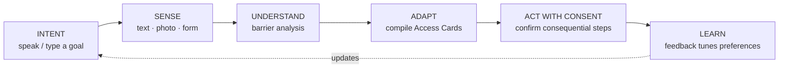
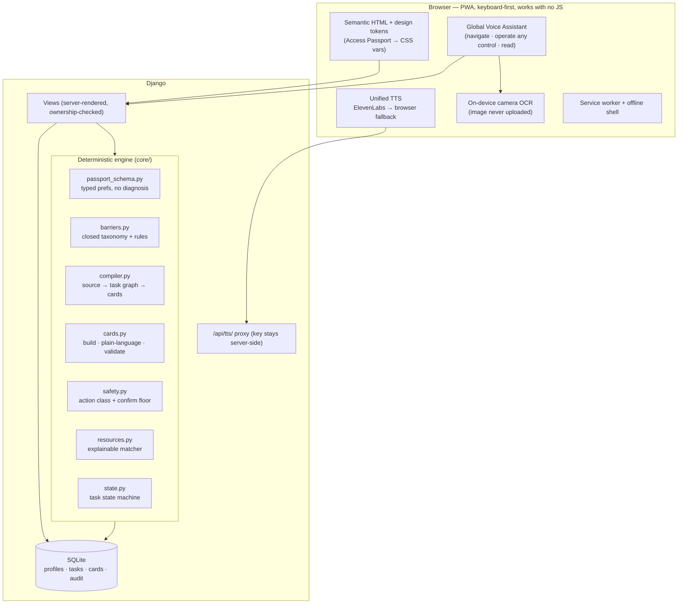
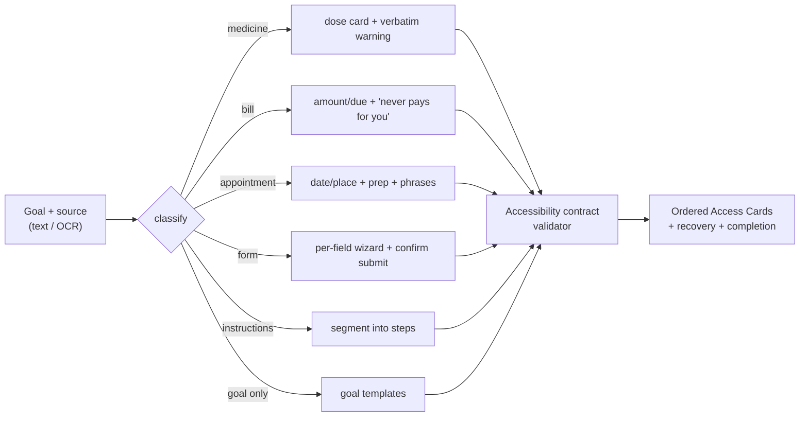
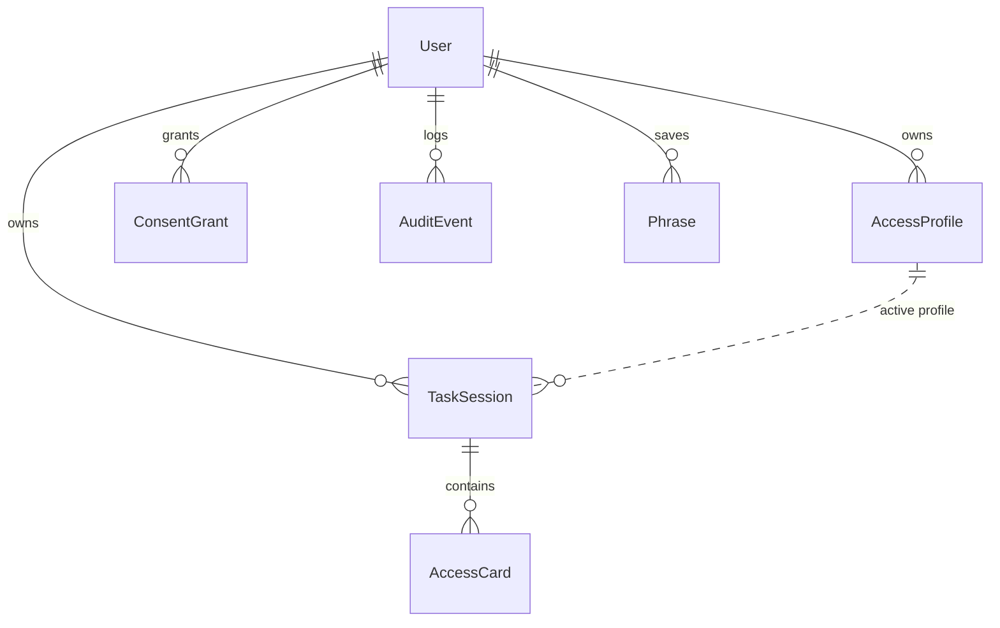

# AccessWeave — Architecture

AccessWeave is a privacy-first Django web app. Its central idea is
**accessibility as compilation**: an inaccessible task is parsed, its barriers are
detected, and it is *recompiled* into a validated sequence of accessible "Access
Cards" rendered in the user's preferred format. A deterministic engine does the
work, so it runs offline with no paid API; optional services (ElevenLabs voice,
a language model, OCR) enhance it but are never required.

## The Access Loop

## System overview

## Compile pipeline

## Key design decisions

| Decision | Why |
|---|---|
| **Deterministic engine, AI optional** | Runs offline, is testable and explainable; never blocks on a paid API. |
| **Preferences, not diagnosis** | The passport stores *how software should behave*, protecting privacy and dignity. |
| **Server-rendered + progressive enhancement** | Every action is a real form/link; JS (voice, speech, OCR) only enhances — nothing is JS-only or voice-only. |
| **Design tokens driven by the passport** | One set of templates renders in each user's format (text size, contrast, motion) — no duplicated pages. |
| **Confirmation *floor* in `safety.py`** | A passport can make confirmations stricter but never weaker; medical actions are always blocked from automation. |
| **On-device OCR / server-side TTS proxy** | The photo never leaves the device; the ElevenLabs key never reaches the browser. |

## Data model (core/models.py)

- **AccessProfile** — the Access Passport (functional preferences JSON).
- **TaskSession** — one task; holds the source (erased on completion when asked),
  the analysis, the task graph, and the current step.
- **AccessCard** — one compiled, validated interface object.
- **ConsentGrant** — scoped, expiring supporter permission (never full-account).
- **AuditEvent** — minimal record that a consequential action happened (no content).
- **Phrase** — saved Communication Bridge quick messages.
